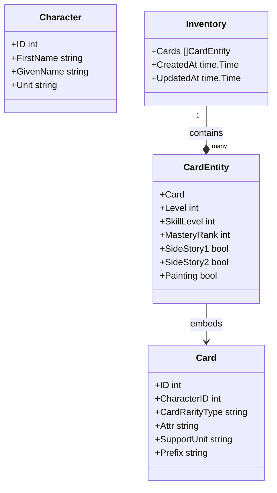

# Sekai Inventory Manager

Sekai Inventory Manager is a command-line tool written in Go for managing and converting inventory data for **Project SEKAI COLORFUL STAGE! feat. Hatsune Miku (プロジェクトセカイ カラフルステージ！ feat. 初音ミク)**. This tool helps players manage their card collection by providing features for tracking, updating, and searching their inventory.

## Features

- **Initialization**
  - Create a new empty inventory file (`init`)

- **Data Management**
  - Add cards to inventory with sensible defaults (`add`)
  - Remove cards from inventory (`remove`)
  - Update card details, including painting status (`change`)
  - Convert old inventory files to the latest schema (`convert`)

- **Search and List**
  - Search available cards that are **not yet in the inventory** (`search`)
  - List inventory contents with detailed information (`list`)
  - Filter by character, rarity, unit, and painting status (for `list`)
  - Inventory statistics summary by rarity at the top of `list` output

- **Data Synchronization**
  - Fetch latest card and character data (`update`)
  - Track data versions in resource files
  - Automatic timestamp management for inventory changes

- **User Interface**
  - Progress indicators for long operations
  - Color-coded output for better readability
  - Human-friendly summaries for add, remove, and change operations
  - Detailed help system (`help`)

## Getting Started

### Prerequisites

- **Go**: Version 1.25 or later (Install from <https://go.dev/dl/>)

### Installation

1. **Build the Project**:

   ```sh
   # Build for your current platform
   go build

   # Cross-compile for specific platforms
   # For Windows
   GOOS=windows GOARCH=amd64 go build -o sekai-inventory.exe
   # For Linux
   GOOS=linux GOARCH=amd64 go build -o sekai-inventory
   # For macOS
   GOOS=darwin GOARCH=amd64 go build -o sekai-inventory
   ```

2. **Run the Program**:

   ```sh
   # Windows
   .\sekai-inventory.exe

   # Linux/macOS
   ./sekai-inventory
   ```

## Commands

### 1. Initialize Inventory

Initialize a new inventory file.

```sh
# Windows
.\sekai-inventory.exe init
# Linux/macOS
./sekai-inventory init
```

### 2. Add Cards

Add one or more cards to the inventory by their IDs.

```sh
# Windows
.\sekai-inventory.exe add <cardID1> [<cardID2> ...]
# Linux/macOS
./sekai-inventory add <cardID1> [<cardID2> ...]
```

### 3. Remove Cards

Remove one or more cards from the inventory by their IDs.

```sh
# Windows
.\sekai-inventory.exe remove <cardID1> [<cardID2> ...]
# Linux/macOS
./sekai-inventory remove <cardID1> [<cardID2> ...]
```

### 4. Search Available Cards

Search for **available cards that are not yet in your inventory** by various fields.

```sh
# Windows
.\sekai-inventory.exe search --<field> <value>
# Linux/macOS
./sekai-inventory search --<field> <value>
```

**Valid Fields**:

- `--character`: Search by character's name.
- `--rarity`: Card rarity (`1`, `2`, `3`, `4`, `bd`).
- `--group`: Unit name (`L/N`, `MMJ`, `VBS`, `WxS`, `N25`, `VS`).

### 5. List Inventory

List cards in your inventory, optionally filtered by various fields.

```sh
# Windows
.\sekai-inventory.exe list [--<field> <value>]
# Linux/macOS
./sekai-inventory list [--<field> <value>]
```

**Valid Fields**:

- `--character`: Filter by character's name.
- `--rarity`: Card rarity (`1`, `2`, `3`, `4`, `bd`).
- `--group`: Unit name (`L/N`, `MMJ`, `VBS`, `WxS`, `N25`, `VS`).
- `--painting`: Filter by painting status (`true`/`false`).

### 6. Change Card Details

Change the details of a card in the inventory.

```sh
# Windows
.\sekai-inventory.exe change <cardID> --<field> <value>
# Linux/macOS
./sekai-inventory change <cardID> --<field> <value>
```

**Valid Fields**:

- `--level`: Card level (`1-60`).
- `--skillLevel`: Skill level (`1-5`).
- `--masteryRank`: Mastery rank (`0-5`).
- `--sideStory1`: Unlock status of side story 1 (`true`/`false`).
- `--sideStory2`: Unlock status of side story 2 (`true`/`false`).
- `--painting`: Painting unlock status (`true`/`false`).

## Program Structure and Flow

### Overview

The program is structured into three main components:

1. **main.go**:
    - Entry point of the application.
    - Parses CLI arguments and routes commands to the appropriate functions.

2. **function/**:
   - Core logic for each command (e.g., `add`, `remove`, `search`, `list`, `change`, `convert`, `update`, `help`).

3. **model/**:
   - Data models: `Card` (immutable game data), `CardEntity` (extends `Card` with user state), `Character`, `Inventory`.

4. **tools/**:
   - Utility functions for:
     - File handling (`LoadInventory`, `SaveInventory`, `LoadCards`, `LoadCharacters`)
     - HTTP fetching from Sekai-World GitHub (`FetchJSON`)
     - Timestamp updates (`UpdateTimeSet`)
     - Formatting and printing (`FormatCardDetails`, `FormatCardLabel`, `FormatRarity`, `FormatBool`, etc.)
     - Helper methods (`ParseFilters`, `ParseCardID`, `CreateCharacterMap`, lookup tables)

### Class Diagram

Below is a class diagram representing the structure of the program (built with Mermaid):



[Mermaid Live Editor](https://mermaid.live/)

### Program Flow

#### Example: Adding a Card (`add`)

1. **User Input**:

   The user runs the command:

    ```sh
    sekai-inventory add 1010
    ```

2. **Command Routing**:

   `main.go` routes the `add` command to the `Add` function in `function/add.go`.

3. **Card Validation**:

   `Add` checks if the card exists in the external `cards.json` file and whether it is already in the inventory.

4. **Inventory Update**:

   - If the card is valid and not already owned, it is added to the inventory with default values.
   - The `UpdatedAt` timestamp is refreshed.

5. **Save Inventory**:

   The updated inventory is saved to `res/inventory.json`.

6. **Success Message**:

   A detailed, human-friendly summary is displayed, for example:

   ```sh
   Added 1 card(s):
     [1010] ୨୧     Kiritani Haruka (MMJ) "Happy Birthday! 2025"
   ```

## References

- **Go Language**: <https://go.dev/>
- **JSON Encoding**: <https://pkg.go.dev/encoding/json>
- **Sekai-World**: <https://github.com/Sekai-World/sekai-master-db-en-diff>
- **fatih/color**: <https://pkg.go.dev/github.com/fatih/color>
- **Mermaid**: <https://mermaid.js.org/>
