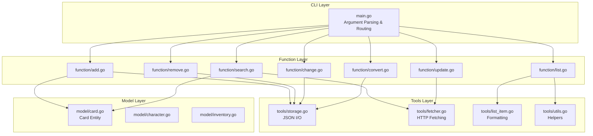

[](https://go.dev/)
[](https://opensource.org/licenses/MIT)
[](https://golangci-lint.run/)

# Sekai Inventory Manager

A command-line tool written in Go for managing and converting inventory data for **Project SEKAI COLORFUL STAGE! feat. Hatsune Miku (プロジェクトセカイ カラフルステージ！ feat. 初音ミク)**. Track, update, and search your card collection with live master data synchronization.

## Features

- **Card Management** — Add, remove, and update cards with detailed properties
- **Live Data Sync** — Fetch latest card and character data from Sekai-World
- **Advanced Search** — Find cards by character, rarity, unit, or painting status
- **Inventory Tracking** — Monitor card levels, mastery ranks, skill levels, and side stories
- **Colorized Output** — Beautiful terminal output with rarity stars and unit badges

## Requirements

| Requirement | Version |
|---|---|
| Go | 1.21+ |
| OS | Windows / Linux / macOS |

## Quick Start

```bash
# Clone the repository
git clone https://github.com/GreydonDesu/sekai-inventory.git
cd sekai-inventory

# Build
go build

# Initialize inventory
./sekai-inventory init

# Update master data
./sekai-inventory update

# Add cards
./sekai-inventory add 1110 1111 1112

# List your collection
./sekai-inventory list --rarity 4 --group MMJ

# Search available cards
./sekai-inventory search --character Haruka --rarity 4
```

## Architecture

The application follows a clean three-layer architecture with clear separation of concerns.



## Data Model

```mermaid
erDiagram
    CARD {
        int ID PK
        int CharacterID
        string CardRarityType
        string Attr
        string SupportUnit
        string Prefix
    }

    CARD_ENTITY {
        CARD
        int Level "1-60"
        int SkillLevel "1-4"
        int MasteryRank "0-5"
        bool SideStory1
        bool SideStory2
        bool Painting
    }

    CHARACTER {
        int ID PK
        string FirstName
        string GivenName
        string Unit
    }

    INVENTORY {
        CardEntity[] Cards
        time CreatedAt
        time UpdatedAt
    }

    CARD_ENTITY ||--o{ CARD : "embeds"
    INVENTORY ||--o{ CARD_ENTITY : "contains"
```

## Tech Stack

| Layer | Technology |
|---|---|
| Language | Go 1.21+ |
| CLI | Manual argument parsing |
| Data Storage | JSON (`encoding/json`) |
| HTTP Client | `net/http` |
| Color Output | `github.com/fatih/color` |
| Linting | `golangci-lint` |

## Commands

| Command | Description |
|---|---|
| `init` | Initialize a new empty inventory |
| `add <id>...` | Add cards by ID with sensible defaults |
| `remove <id>...` | Remove cards by ID |
| `change <id> --field <value>` | Update card properties |
| `search --<field> <value>` | Find cards not in inventory |
| `list [--<field> <value>]` | List inventory with filters |
| `update` | Sync latest master data from Sekai-World |
| `convert` | Convert old inventory schema to latest |
| `help` | Display detailed help information |

## Card Fields

| Field | Type | Range | Description |
|---|---|---|---|
| `level` | int | 1–60 | Card level |
| `skillLevel` | int | 1–4 | Skill level |
| `masteryRank` | int | 0–5 | Mastery rank |
| `sideStory1` | bool | true/false | Side story 1 unlock |
| `sideStory2` | bool | true/false | Side story 2 unlock |
| `painting` | bool | true/false | Painting unlock |

## Data Files

| File | Location | Purpose |
|---|---|---|
| `inventory.json` | `res/` | User's card collection |
| `cards.json` | `res/` | Game card database |
| `gameCharacters.json` | `res/` | Character metadata |
| `skills.json` | `res/` | Skills data |
| `metadata.json` | `res/` | Fetch timestamps & Git commit |

## License

This project is licensed under the MIT License — see the [LICENSE](LICENSE) file for details.

## References

- **Go Language**: <https://go.dev/>
- **JSON Encoding**: <https://pkg.go.dev/encoding/json>
- **Sekai-World**: <https://github.com/Sekai-World/sekai-master-db-en-diff>
- **fatih/color**: <https://pkg.go.dev/github.com/fatih/color>
- **golangci-lint**: <https://golangci-lint.run/>
- **Mermaid**: <https://mermaid.js.org/>
