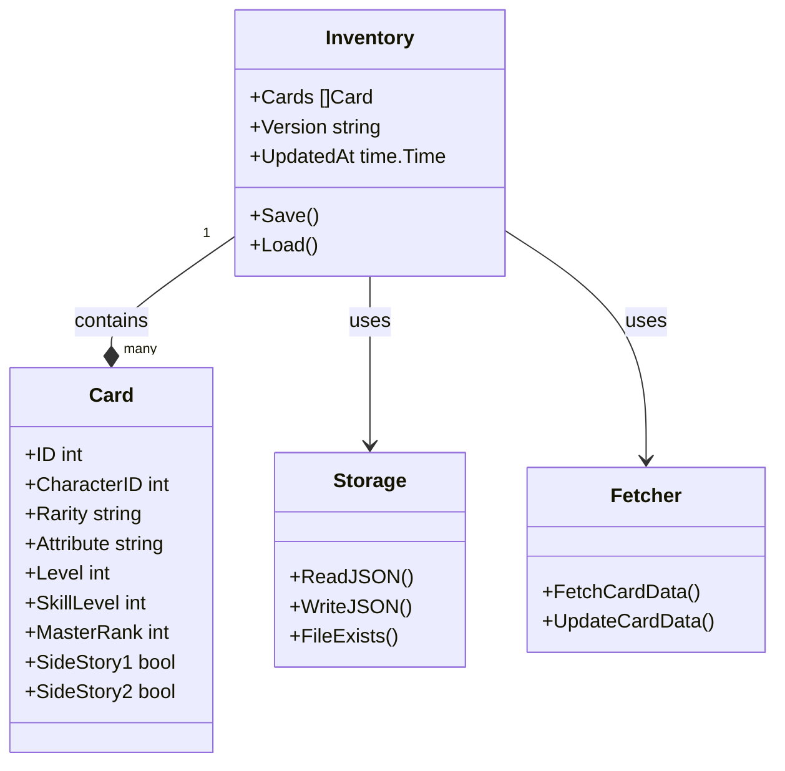

# Sekai Inventory Manager

Sekai Inventory Manager is a command-line tool written in Go for managing and converting inventory data for **Project SEKAI COLORFUL STAGE! feat. Hatsune Miku (プロジェクトセカイ カラフルステージ！ feat. 初音ミク)**. This tool helps players manage their card collection by providing features for tracking, updating, and searching their inventory.

## Features

- **Initialization**: Create a new empty inventory file (`init`)
- **Data Management**:
  - Add cards to inventory (`add`)
  - Remove cards from inventory (`remove`)
  - Update card details (`change`)
- **Search and List**:
  - Search available cards (`search`)
  - List inventory contents (`list`)
  - Filter by character, rarity, or unit
- **Data Synchronization**:
  - Fetch latest card data (`update`)
  - Track data versions
  - Automatic timestamp management
- **User Interface**:
  - Progress indicators for long operations
  - Color-coded output for better readability
  - Detailed help system

## Getting Started

### Prerequisites

- **Go**: Version 1.18 or later (Install from <https://go.dev/dl/>)

### Installation

1. **Build the Project**:

   ```shell
   # Build for your current platform
   go build

   # Cross-compile for specific platforms
   # For Windows
   GOOS=windows GOARCH=amd64 go build -o sekai-inventory.exe
   # For Linux
   GOOS=linux GOARCH=amd64 go build -o sekai-inventory
   # For macOS
   GOOS=darwin GOARCH=amd64 go build -o sekai-inventory
   ```

2. **Run the Program**:

   ```shell
   # Windows
   .\sekai-inventory.exe

   # Linux/macOS
   ./sekai-inventory
   ```

### Running Tests

1. **Run All Tests**:

   ```shell
   go test ./...
   ```

2. **Run Tests with Coverage**:

   ```shell
   # Generate coverage report
   go test -coverprofile=coverage.out ./...

   # View coverage in browser
   go tool cover -html=coverage.out

   # View coverage in terminal
   go tool cover -func=coverage.out
   ```

## Program Structure and Flow

### Overview

The program is structured into three main components:

1. **main.go**:
    - The entry point of the application.
    - Routes commands to the appropriate functions.

2. **function/**:
   - Contains the core logic for each command (e.g., add, remove, search, change, convert).

3. **model/**:
   - Defines the data models for the inventory and cards.

4. **tools/**:
   - Contains utility functions for file handling, timestamp updates, and other helper methods.

### Class Diagram

Below is a class diagram representing the structure of the program (built with Mermaid):



[Mermaid Live Editor](https://mermaid.live/)

### Program Flow

#### Example: Adding a Card (`add`)

1. **User Input**:
   - The user runs the command:

    ```bash
    sekai-inventory add 1010
    ```

2. **Command Routing**:

   - `main.go` routes the add command to the `AddCards` function in `function/add.go`.

3. **Card Validation**:

   - The `AddCards` function checks if the card exists in the external `cards.json` file.

4. **Inventory Update**:

   - The card is added to the inventory, and the `UpdatedAt` timestamp is updated.

5. **Save Inventory**:

   - The updated inventory is saved to `inventory.json`.

6. **Success Message**:

   - A success message is displayed to the user:

        `Added card with IDs [1010]`

## Commands

### 1. Initialize Inventory

Initialize a new inventory file.

```shell
# Windows
.\sekai-inventory.exe init
# Linux/macOS
./sekai-inventory init
```

### 2. Add Cards

Add one or more cards to the inventory by their IDs.

```shell
# Windows
.\sekai-inventory.exe add <cardID1> [<cardID2> ...]
# Linux/macOS
./sekai-inventory add <cardID1> [<cardID2> ...]
```

### 3. Remove Cards

Remove one or more cards from the inventory by their IDs.

```shell
# Windows
.\sekai-inventory.exe remove <cardID1> [<cardID2> ...]
# Linux/macOS
./sekai-inventory remove <cardID1> [<cardID2> ...]
```

### 4. Search Inventory

Search for cards in the inventory by various fields.

```shell
# Windows
.\sekai-inventory.exe search --<field> <value>
# Linux/macOS
./sekai-inventory search --<field> <value>
```

**Valid Fields**:

- `--character`: Search by character's name.
- `--rarity`: Card rarity (1, 2, 3, 4, bd).
- `--group`: Unit name (L/N, MMJ, VBS, WxS, N25, VS).

### 5. Change Card Details

Update the details of a card in the inventory.

```shell
# Windows
.\sekai-inventory.exe change <cardID> --<field> <value>
# Linux/macOS
./sekai-inventory change <cardID> --<field> <value>
```

***Valid Fields**:

- `--level`: Card level (1-60).
- `--skillLevel`: Skill level (1-5).
- `--masterRank`: Master rank (0-5).
- `--sideStory1`: Unlock status of side story 1 (`true`/`false`).
- `--sideStory2`: Unlock status of side story 2 (`true`/`false`).

## References

- **Go Language**: <https://go.dev/>
- **JSON Encoding**: <https://pkg.go.dev/encoding/json>
- **Sekai-World**: <https://github.com/Sekai-World/sekai-master-db-en-diff>
- **fatih/color**: <https://pkg.go.dev/github.com/fatih/color>
- **Mermaid**: <https://mermaid.js.org/>
